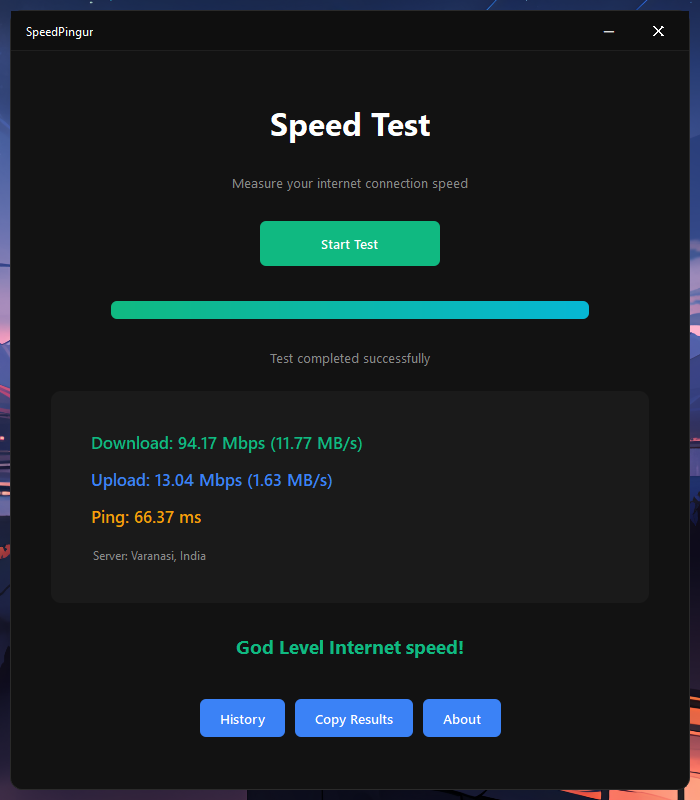
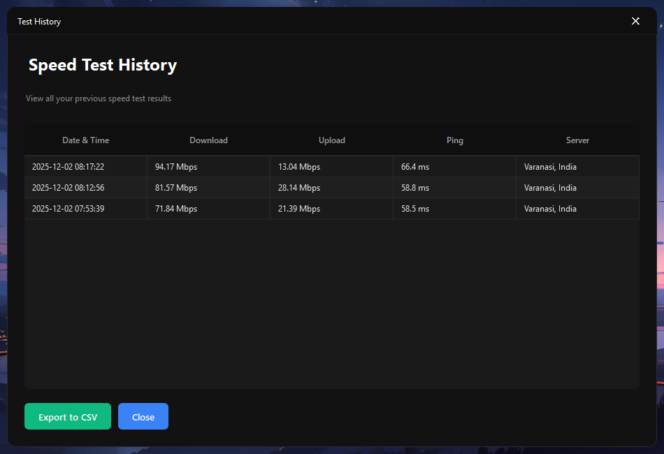

# SpeedPingur ⚡

> Lightning-fast internet speed testing for Windows

Test your download, upload, and ping in under a second. Modern UI, automatic history tracking, CSV export.

[](LICENSE.md)
[](https://github.com/TheStoicSpirit/SpeedPingur/releases)
[](https://www.microsoft.com/windows)

---

## ✨ Features

- **⚡ Fast** - Launches in < 1.5 seconds
- **📊 Real-Time** - Live speed monitoring
- **📈 History** - Auto-saved test results
- **💾 Export** - CSV export for analysis
- **🎨 Modern** - Clean dark interface
- **🔒 Private** - All data stored locally

## 📸 Screenshots



*Main interface - Ready to test*


*Live speed test in progress*



*View all past test results*

## 🚀 Quick Start

### Download

Get from [Releases](https://github.com/TheStoicSpirit/SpeedPingur/releases/latest):

- **SpeedPingur-Setup.exe** - Installer (recommended)
- **SpeedPingur-Portable.zip** - Portable version

### Install

**Installer:**
```
1. Run SpeedPingur-Setup.exe
2. Follow wizard
3. Done!
```

**Portable:**
```
1. Extract ZIP
2. Run SpeedPingur.exe
```

### Use

```
1. Launch app
2. Click "Start Test"
3. Wait 30-60 seconds
4. View results
```

## 📖 Docs

- [Installation Guide](docs/INSTALLATION.md)
- [User Guide](docs/USER_GUIDE.md)
- [Troubleshooting](docs/TROUBLESHOOTING.md)

## 🛠️ Troubleshooting

**App won't start?**
```
Install: https://aka.ms/vs/17/release/vc_redist.x64.exe
Or run as administrator
```

**Test fails?**
```
- Check internet connection
- Disable VPN
- Restart router
```

**Antivirus blocking?**
```
Add to exclusions: C:\Program Files\SpeedPingur
```

More help: [TROUBLESHOOTING.md](docs/TROUBLESHOOTING.md)

## 🤝 Support

- 🐛 [Report Issues](https://github.com/TheStoicSpirit/SpeedPingur/issues)
- 💬 [Discussions](https://github.com/TheStoicSpirit/SpeedPingur/discussions)

## 📜 License

**Proprietary Software** - Copyright © 2025 The Stoic Spirit

See [LICENSE.md](LICENSE.md) for terms.

Third-party components: [THIRD_PARTY_LICENSES.md](THIRD_PARTY_LICENSES.md)

---

**Made with ❤️ in India**

If helpful: ⭐ Star • 🐛 Report bugs • 💡 Suggest features